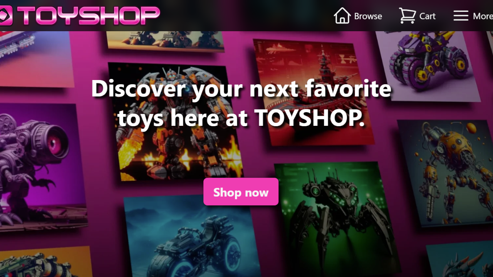

## About

[](https://www.youtube.com/watch?v=tzRS64eEUR8)

#### Tools

-   A fictional online store built with [Remix](https://remix.run).
-   Written in [Typescript](https://www.typescriptlang.org) for enhanced type safety.
-   Responsive design and efficient styling using [Tailwind CSS](https://tailwindcss.com).
-   Implemented [Supabase](https://supabase.com) for database management and authentication.
-   CI/CD with [Vitest](https://vitest.dev) and [GitHub Actions](https://github.com/features/actions).
-   Integrated [Stripe](https://stripe.com) for secure and smooth transactions.
-   [DiceBear](https://www.dicebear.com) for avatar customization and [Three.js](https://threejs.org) for 3D animation.

#### Links

-   Live site: [https://hynguyen.me/toyshop](https://hynguyen.me/toyshop)
-   Demo video: [link](https://www.youtube.com/watch?v=tzRS64eEUR8)

## Usage

### Install dependencies

```sh
yarn install
```

### Development mode

```sh
yarn dev
```

### Run tests

```sh
yarn test
```

### Deployment

```sh
yarn build
yarn start
```

### Generate DB types

Replace `abcd12345` with project ID.

```sh
yarn supabase gen types typescript --project-id abcd12345 > database.types.ts
```

### Environment variables

```sh
SESSION_SECRET=(any random string for cookie session)

SUPABASE_URL=
SUPABASE_ANON_KEY=
SUPABASE_IMAGES_PATH=

STRIPE_SECRET_KEY=
STRIPE_RETURN_URL=(example: http://localhost:3000/pay/success)

PROMO_DOUBLE_TAGS_JSON=(example: white_16&c_21)
PROMO_BRAND=(example: yellow)
```

## Others

[Tailwind VSCode extension](https://marketplace.visualstudio.com/items?itemName=bradlc.vscode-tailwindcss)
